# Double Slit Experiment
---

# Data Graph
## Singe Slit
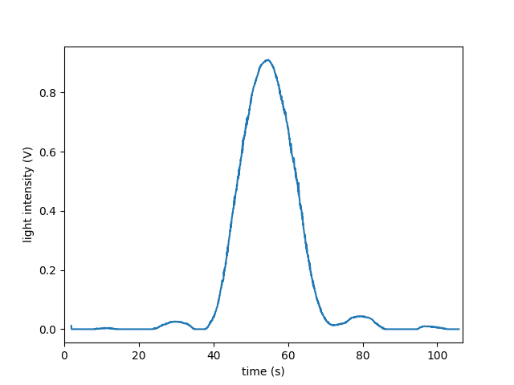
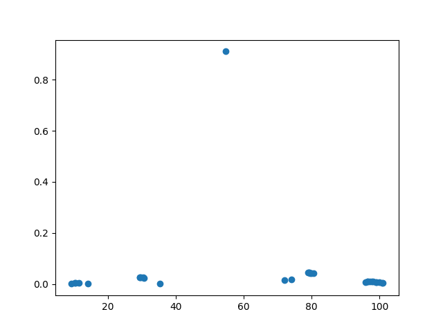
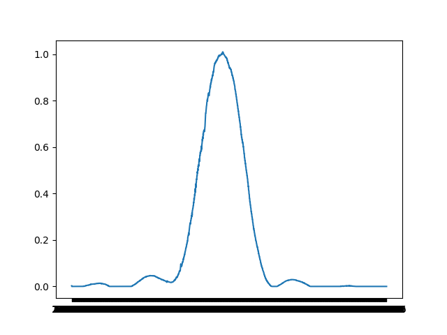
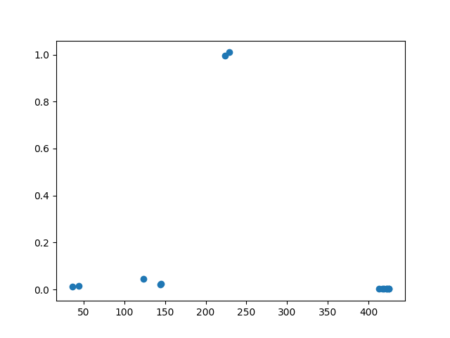

## Double Slit
<!-- ### Data 1
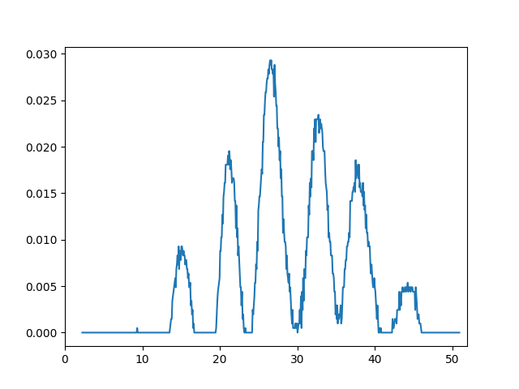
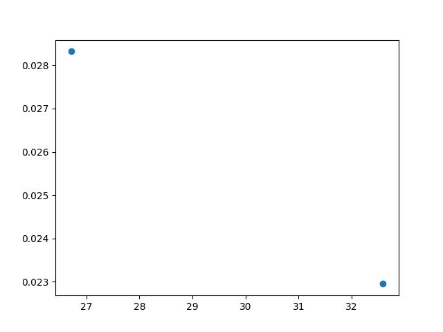
### Data 2
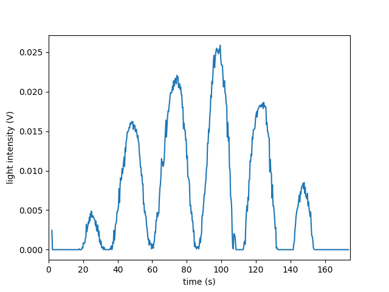
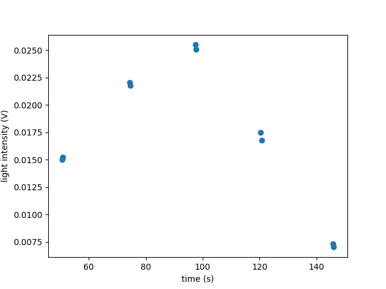
### Data 3
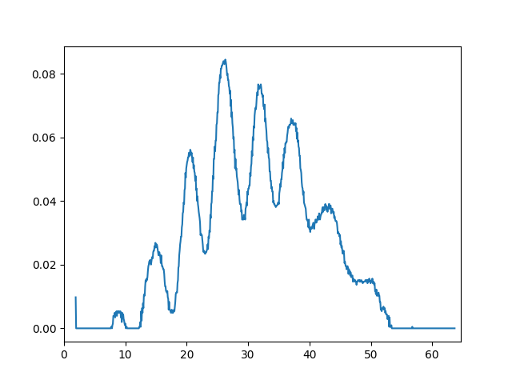
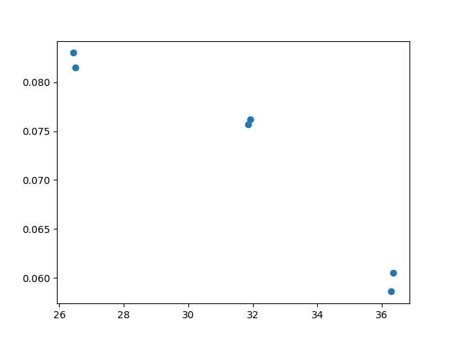
### Data 4
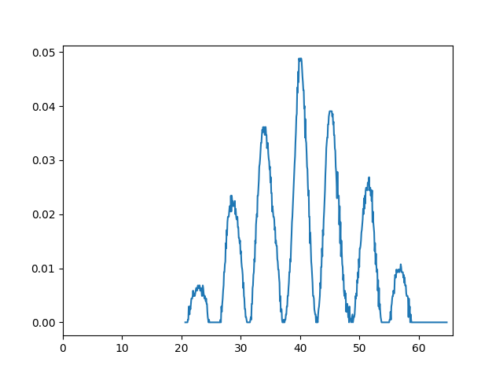
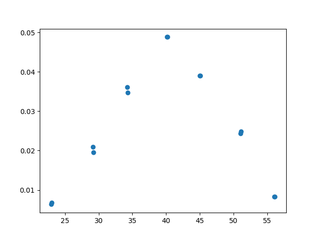
### Data 5
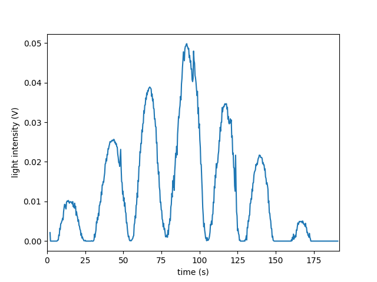
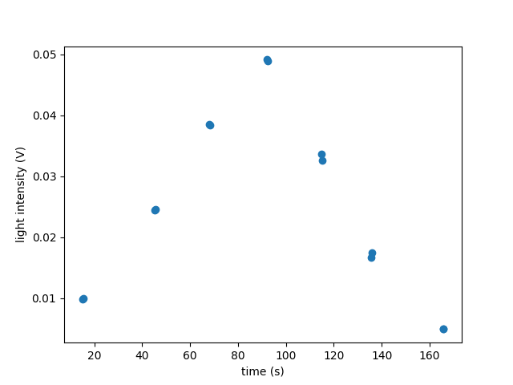 -->
### Data 6
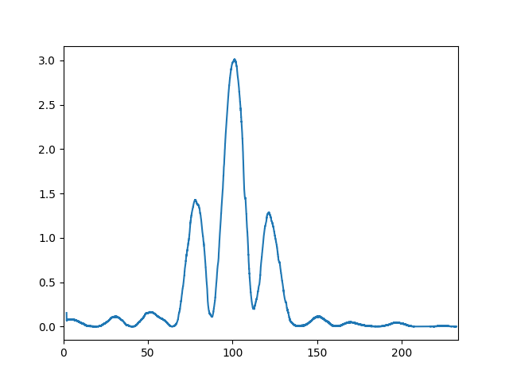
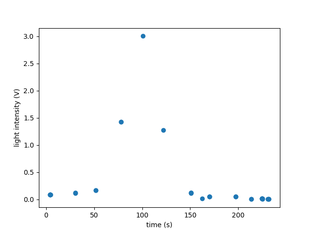
### Data 7
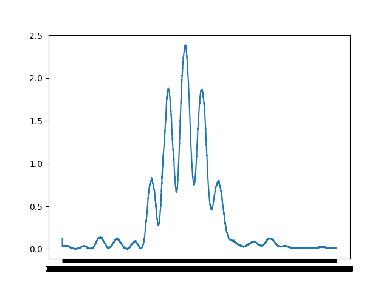
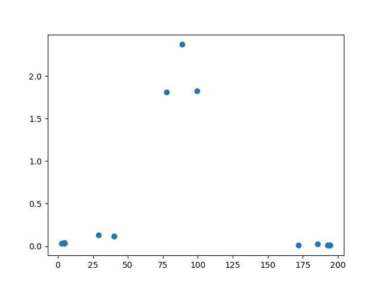
### Data 8
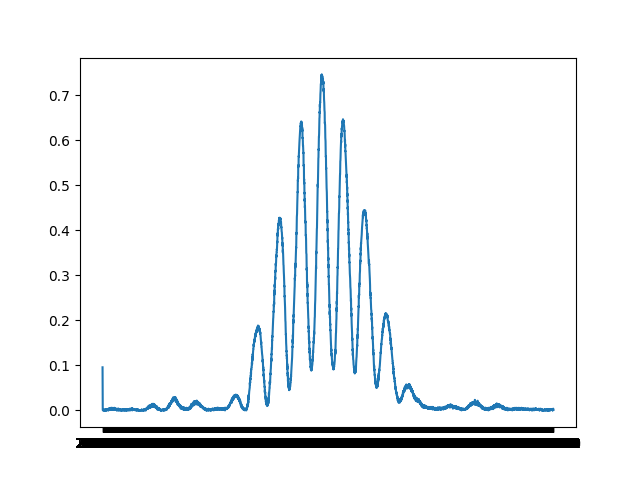
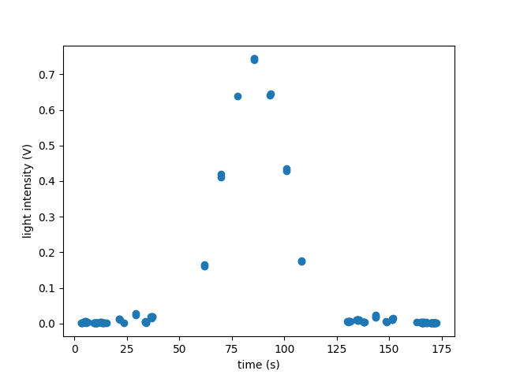
### Data 9
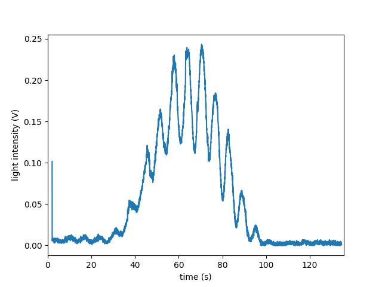
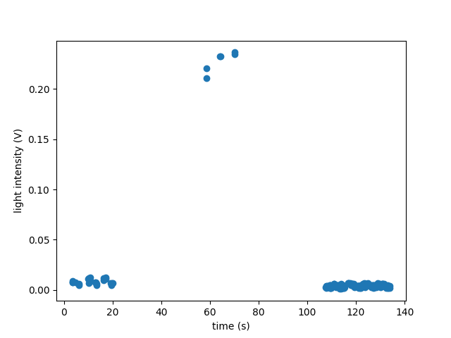