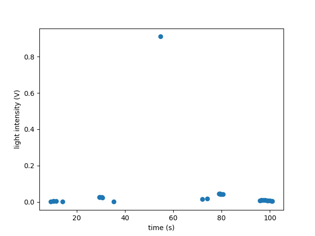
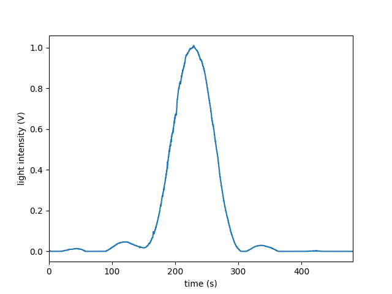
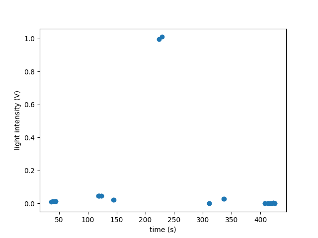
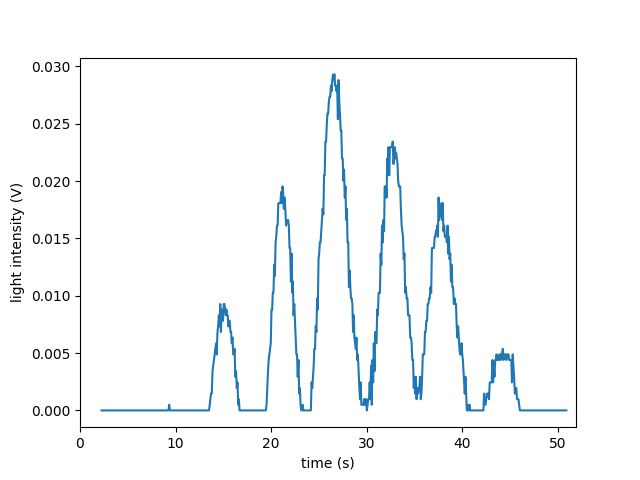
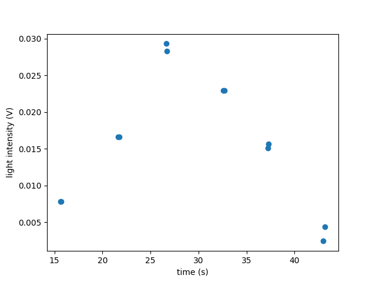
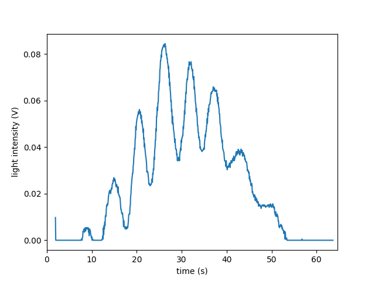
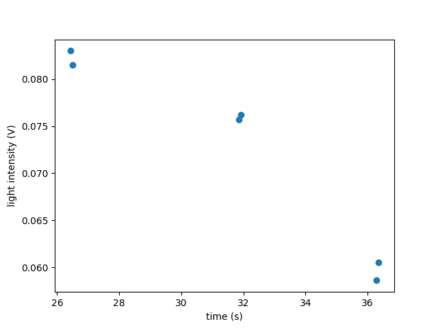
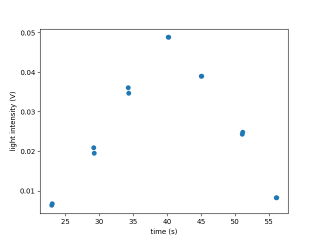
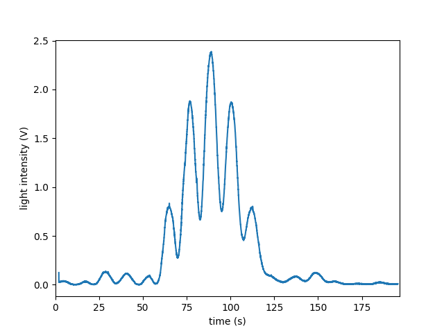
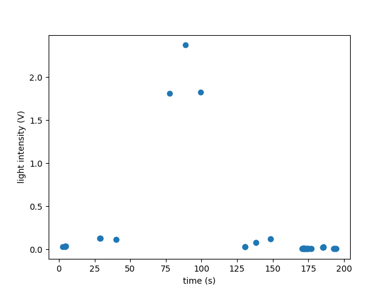

# Double Slit Experiment
---

# Data Graph
## Singe Slit

## Double Slit
<!-- ### Data 1

### Data 2

### Data 3

### Data 4

### Data 5

 -->
### Data 6

### Data 7

### Data 8

### Data 9

